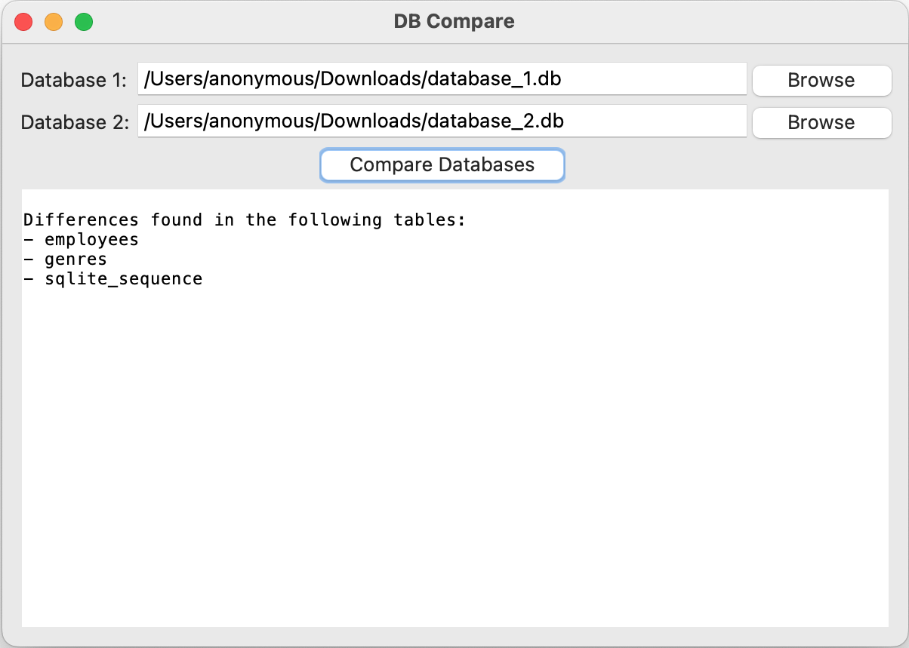
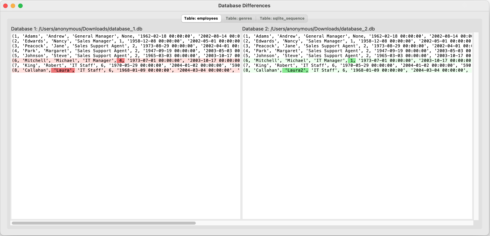

# SQLite Database Comparison Tool


## Summary

A lightweight application for comparing two SQLite databases, helping developers identify differences in structure and content efficiently.

<div align="center">
  
</div>
<div align="center">
  
</div>

## Features

- **Easy File Selection**: Simple browsing for SQLite database files.
- **Side-by-Side Comparison**: View two tables next to each other.
- **Highlighted Differences**: Color-coded highlights for easy identification of changes.
- **Minimalist GUI**: Built with Tkinter, no extra modules required.

## Installation

1. Ensure Python 3.x is installed.
2. Clone the repository or download the source code.

## Usage

1. Run the application:
   ```bash
   python main.py


**Keywords**: SQLite, Database Comparison, Open Source, Data Analysis, GUI Tool, Tkinter, Database Merge, Data Visualization, Database Management.
